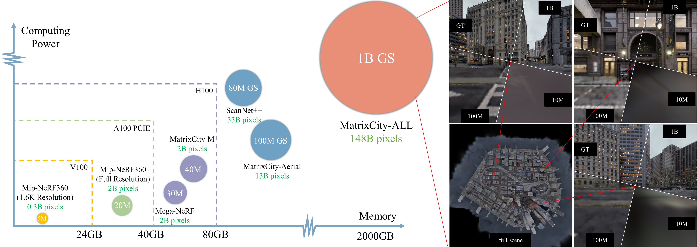
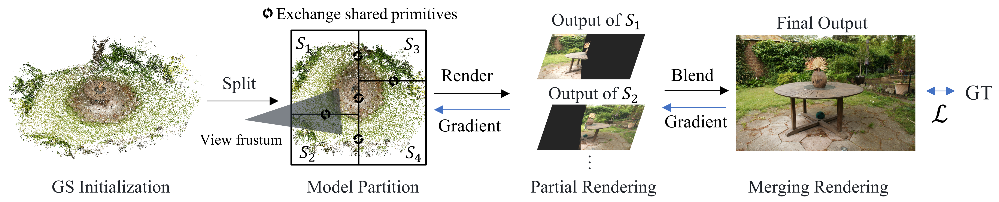

# RetinaGS: Scalable Training for Dense Scene Rendering with Billion-Scale 3D Gaussians



We introduce RetinaGS, which explores the possibility of training high-parameter 3D Gaussian splatting (3DGS) models on large-scale, high-resolution datasets. This codebase maintain a model parallel traning framework for native 3DGS which uses a proper rendering equation and can be applied to any scene and arbitrary distribution of Gaussian primitives. 




[[Project Page]](https://ai-reality.github.io/RetinaGS/)
[[Paper]](https://arxiv.org/pdf/2406.11836)

## Prerequisites

1. Clone this repository:
```
git clone https://github.com/mthreads/DenseGaussian.git --recursive
cd DenseGaussian
```


2. Installation:

```shell
conda env create --file environment.yml
conda activate retina_gs
```

Please note that we only test RetinaGS on Ubuntu 20.04.1 LTS.

## Usage

### Download Data and Pretrained Model

Get data and pretrained models ([[Garden]](https://ai-reality.github.io/RetinaGS/)). 把data_Garden放到data/下，model_Garden放到model/下.

### Evaluation

```
CUDA_VISIBLE_DEVICES=0,1 torchrun --nnodes=1 --nproc_per_node=2 --master_addr=127.0.0.1 --master_port=7356 \
    main_mp_tree.py -s data/data_Garden -m model/model_Garden \
        --bvh_depth 2 --WHOLE_MODEL \
        --max_batch_size 4  --max_load 8  \
        -r 1 --eval \
        --EVAL_ONLY --SAVE_EVAL_IMAGE --SAVE_EVAL_SUB_IMAGE
```

Our implement is based on 3DGS (https://github.com/graphdeco-inria/gaussian-splatting). 使用3DGS仓库训练的模型可以直接跑（替换-s和-m即可）. 
<details>
<summary><span style="font-weight: bold;">Command Line Arguments for main_MP_tree.py under Evaluation</span></summary>
Arguments of 3DGS我们大部分保留. 

  #### CUDA_VISIBLE_DEVICES=0,1
  指定编号为CUDA_0和CUDA_1的GPU参与Evaluation.
  #### --nnodes=1 --nproc_per_node=2
  机器数量为1，GPU数量为2.
  #### --master_addr=127.0.0.1 --master_port=7356
  the host and port of torchrun. 注意同一台机器上不同训练任务间的--master_port需要不同.
  #### --source_path / -s
  Path to the source directory containing a COLMAP or Synthetic NeRF data set.
  #### --model_path / -m 
  Path where the trained model is stored. 
  #### --resolution / -r
  Specifies resolution of the loaded images before training. If provided 1, 2, 4 or 8, uses original, 1/2, 1/4 or 1/8 resolution, respectively. For all other values, rescales the width to the given number while maintaining image aspect. If not set and input image width exceeds 1.6K pixels, inputs are automatically rescaled to this target.
  #### --eval
  Add this flag to use a MipNeRF360-style training/test split for evaluation.
  #### --bvh_depth
  Argument for controlling the number of submodels. Here, you would create 2<sup>bvh_depth</sup> submodels. In this example, bvh_depth=2, namely total 4 submodels (2 submodels for each GPU). 
  #### --WHOLE_MODEL
  仅读入单个ply
  #### --max_batch_size --max_load 
  Arguments for controlling memory cost, a render task for a submodel weight 1 load, thus "--max_batch_size 4  --max_load 8" just set every batch as size of 4 in this case. 当显存不够时，请尝试降低这两个值.
  #### --EVAL_ONLY --SAVE_EVAL_IMAGE --SAVE_EVAL_SUB_IMAGE
  仅进行Evaluation，且保存图像和每个submodel输出的子图像。

</details>
<br>


### Single Machine Training 
For single machine, an example of using default densification strategy and Colmap Initialization  command is:
```
CUDA_VISIBLE_DEVICES=0,1 torchrun --nnodes=1 --nproc_per_node=2 --master_addr=127.0.0.1 --master_port=7356 \
    main_mp_tree.py -s data/data_Garden -m model/model_Garden_default_densification \
        --bvh_depth 2 --WHOLE_MODEL \
        --max_batch_size 4  --max_load 8 \
        -r 1 --eval \
        --epochs 187
```


For single machine, an example of 从MVS Initialization出发，关闭点管理 (RetinaGS paper中的训练方式) command is:
```
CUDA_VISIBLE_DEVICES=0,1 torchrun --nnodes=1 --nproc_per_node=2 --master_addr=127.0.0.1 --master_port=7356 \
    main_MP_tree.py -s data/data_Garden -m model/model_Garden_MVS \
        --bvh_depth 2 --WHOLE_MODEL \
        --max_batch_size 4  --max_load 8 \
        -r 1 --eval \
        --epochs 187 \
        --position_lr_init 0.0000016 --position_lr_final 0.000000016 --densify_until_iter 0 \
        --points3D MVS_points3D --pointcloud_sample_rate 1        
```

<details>
<summary><span style="font-weight: bold;">Command Line Arguments for main_MP_tree.py under Training</span></summary>

Arguments of 3DGS我们大部分保留. 

MVS点使用colmap稠密重建得到，见scripts/colmap_MVS.sh.

  #### --WHOLE_MODEL
  输出单独ply文件，当GS数量过多时，可以考虑不加该flag以提升读取和写入速度.

  #### --epochs
  指定训练epoch数量.
  
  #### --position_lr_init --position_lr_final
  Initial and Final 3D position learning rate, ```0.00016``` and ```0.0000016``` by default.

  #### --densify_until_iter
  Iteration where densification stops, ```15000``` by default and ```0``` for abandon.

  #### --points3D
  指定初始化使用的点云文件.

  #### --pointcloud_sample_rate
  指定初始化时下采样率，If provided N, uses 1/N point cloud. 当采用MVS初始化训练，显存不够时可以考虑增加降采样比例.

</details>
<br>

### Multiple Machines Training 

For multiple machines, start command on each node with corresponding parameters, and example shell scripts for launching/stopping multiple nodes training can be found in multi_node_cmds/

### Model Zoo

| Data and Model                                                | PSNR | #GS   |resolution|
|:-----------------:                                            |:----:|:-----:|:-----:   |
| [[Room-1.6k]](https://ai-reality.github.io/RetinaGS/)         |32.86 |22.41M |1600×1036 |
| [[Bicycle]](https://ai-reality.github.io/RetinaGS/)           |24.86 |31.67M |4944×3284 |
| [[MatrixCity-Aerial]](https://ai-reality.github.io/RetinaGS/) |27.70 |217.3M |1920×1080 |

M means Million. See Appendix in [[Paper]](https://arxiv.org/pdf/2406.11836) for complete results. Add -r 1600 flag while evaluate Room-1.6k.

## To Do
- [ ] Output as one whole model  
- [ ] 优化读入单独ply（send recv形式）
- [ ] 加上指定iteration的训练
- [ ] 支持Evaluation输出LPIPS和SSIM
- [ ] data_Garden
- [ ] Model Zoo的准备和描述
- [ ] 更多训练参数描述
- [ ] 说明paper呈现结果是用的另一个分支（本分支主要优化结构，使其更易读易改）
- [ ] 说明MatrixCity-Aerial的下载和推理
- [ ] 清理多余文件
- [ ] 1.6k输出时多余提示
- [x] Colmap MVS脚本 + 说明

## Citation
Please cite the following paper if you use this repository in your reseach or work.
```
@article{li2024retinags,
  title={RetinaGS: Scalable Training for Dense Scene Rendering with Billion-Scale 3D Gaussians},
  author={Li, Bingling and Chen, Shengyi and Wang, Luchao and He, Kaimin and Yan, Sijie and Xiong, Yuanjun},
  journal={arXiv preprint arXiv:2406.11836},
  year={2024}
}
```

## License
Copyright @2023-2024 Moore Threads Technology Co., Ltd("Moore Threads"). All rights reserved. This software may contains part codes from gaussian-splatting，gaussian-splatting is licensed under the Gaussian-Splatting License. Some files of gaussian-splatting may have been modified by Moore Threads Technology Co., Ltd.  Certain derivative work developed by Moore Threads Technology Co., Ltd are subject to the Gaussian-Splatting License.

## Contact
```
Bingling Li    :   lblhust903@gmail.com
Shengyi Chen   :   pythonchanner@gmail.com
```


