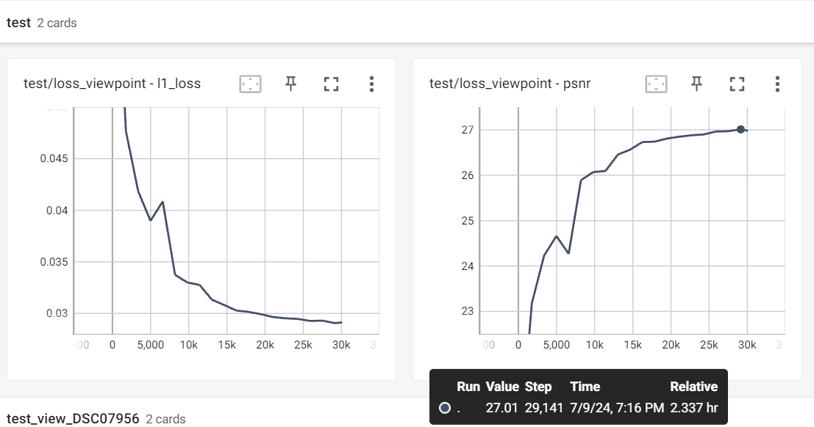

# RetinaGS: Scalable Training for Dense Scene Rendering with Billion-Scale 3D Gaussians

We introduce RetinaGS, which explores the possibility of training high-parameter 3D Gaussian splatting (3DGS) models on large-scale, high-resolution datasets. This codebase maintain a model parallel traning framework for native 3DGS which uses a proper rendering equation and can be applied to any scene and arbitrary distribution of Gaussian primitives. 

[[Project Page]](https://ai-reality.github.io/RetinaGS/)
[[Paper]](https://arxiv.org/pdf/2406.11836)

## Prerequisites
...
### Installation
...
### Get pretrained models
Garden/Scan
... 

## Usage


### Evaluation
... demo ...

### Model Zoo
Model, Splited Model, PSNR, #GS。。。。
Garden
Scan
MatrixCity Aerial
Full MatrixCity
...

### Data 
The data should be orgnised as follows:
```
data/
├── dataset_name
│   ├── scene1/
│   │   ├── images
│   │   │   ├── IMG_0.jpg
│   │   │   ├── IMG_1.jpg
│   │   │   ├── ...
│   │   ├── sparse/
│   │       └──0/
│   ├── scene2/
│   │   ├── images
│   │   │   ├── IMG_0.jpg
│   │   │   ├── IMG_1.jpg
│   │   │   ├── ...
│   │   ├── sparse/
│   │       └──0/
```

### Training 
An example for 4-times downsampled graden (for the best consistentance with original 3D-GS train.py, it sets MAX_BATCH_SIZE as 1 which actually lowers the training speed):
```
CUDA_VISIBLE_DEVICES=4,5,6,7 torchrun --standalone --nnodes=1 --nproc_per_node=4 \
    --master_addr=127.0.0.1 --master_port=7356 \
    train_mp_tree.py -s data/garden \
        -m backup/mp_garden_shared_gs --bvh_depth 2 \
        --eval --log_level 20 --SHRAE_GS_INFO \
        --epochs 187 \
        --scaling_lr_init 0.005 \
        --scaling_lr_final 0.005 \
        --densification_interval 600 \
        --densify_until_iter 15000 \
        --opacity_reset_interval 3000 \
        --MAX_BATCH_SIZE 1  --MAX_LOAD 8 \
        --EVAL_INTERVAL_EPOCH 10 --SAVE_INTERVAL_EPOCH 30 \
        --ENABLE_REPARTITION --REPARTITION_INTERVAL_EPOCH 50  --REPARTITION_START_EPOCH 1 --REPARTITION_END_EPOCH 200
```
Here is a screenshot of tensorboard (The 2.337 hours is not very representive, there were other training processes on the same server.):



## Citation
Please cite the following paper if you use this repository in your reseach or work.
```
@article{li2024retinags,
  title={RetinaGS: Scalable Training for Dense Scene Rendering with Billion-Scale 3D Gaussians},
  author={Li, Bingling and Chen, Shengyi and Wang, Luchao and He, Kaimin and Yan, Sijie and Xiong, Yuanjun},
  journal={arXiv preprint arXiv:2406.11836},
  year={2024}
}
```
## License
Copyright @2023-2024 Moore Threads Technology Co., Ltd("Moore Threads"). All rights reserved. This software may contains part codes from gaussian-splatting，gaussian-splatting is licensed under the Gaussian-Splatting License. Some files of gaussian-splatting may have been modified by Moore Threads Technology Co., Ltd.  Certain derivative work developed by Moore Threads Technology Co., Ltd are subject to the Gaussian-Splatting License.

## Contact
```
Bingling Li    :   lblhust903@gmail.com
Shengyi Chen   :   pythonchanner@gmail.com
```


